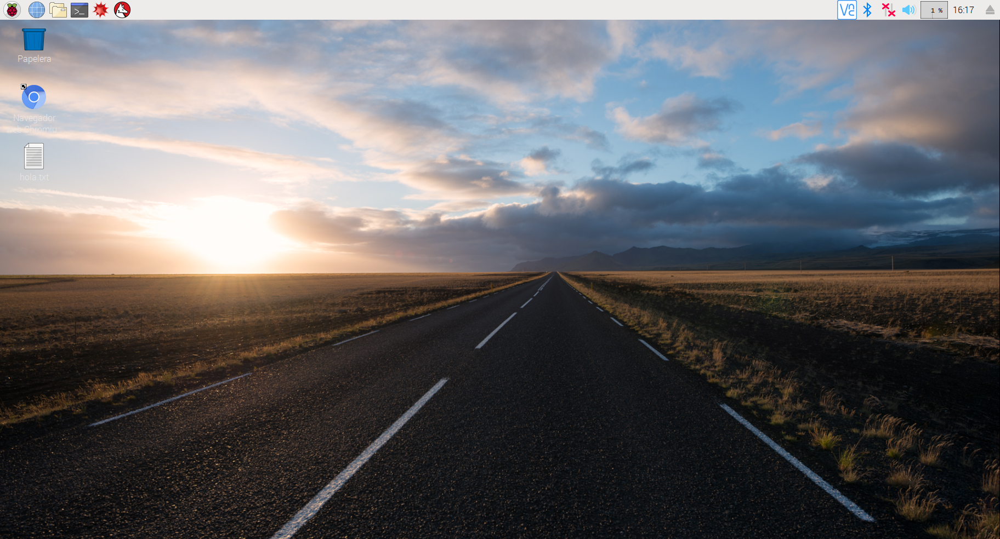
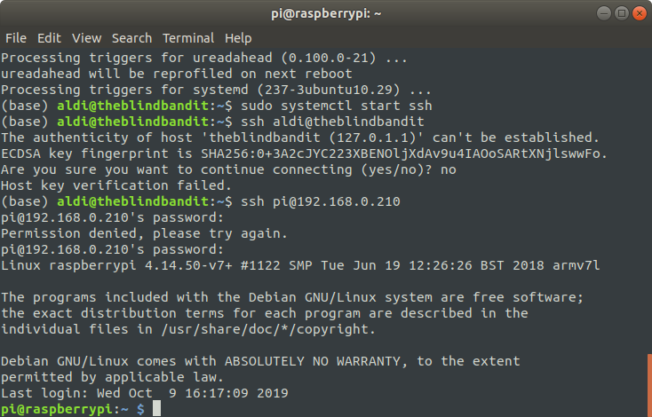
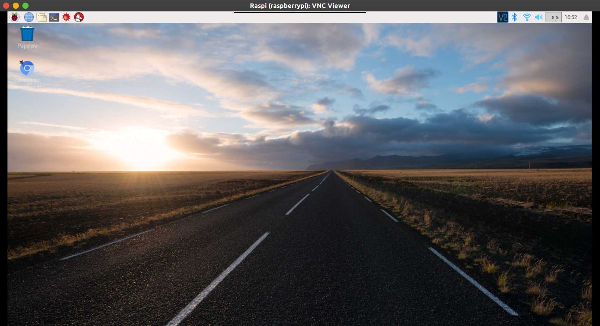
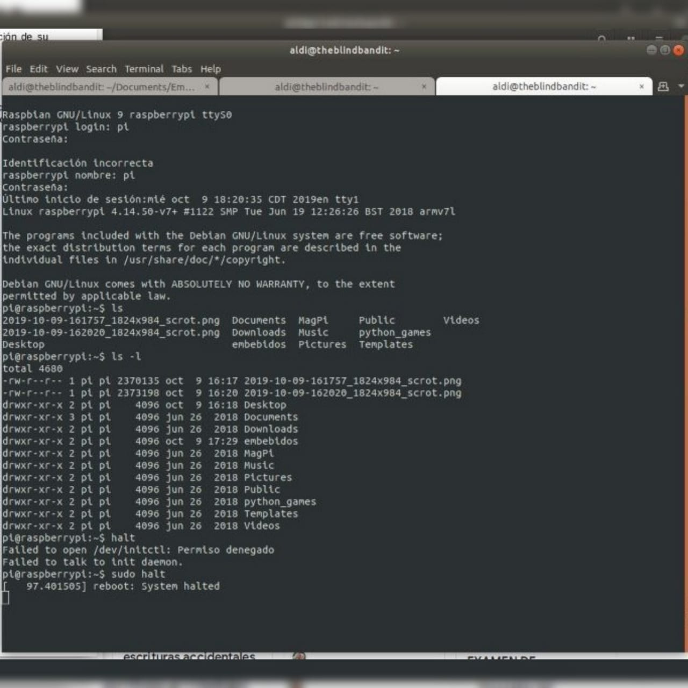

# REPORTE DE USO DE RASPBERRY

# EQUIPO 10

### ÍNDICE
1. [USO DE RASPBERRY COMO PC](#uno)

2. [CONEXIÓN POR SSH](#dos)

3. [CONEXIÓN POR VNC](#tres)

4. [CONEXIÓN POR CONSOLA](#cuatro)

5. [INTEGRANTES DEL EQUIPO](#cinco)

## USO DE RASPBERRY COMO PC

Para este modo de operación conectamos un monitor, mouse y teclado a la raspberry. Para ello mostramos una captura a continuación.

## CONEXIÓN POR SSH
Para este modo de operación se va a probar cómo se puede conectar un host a través del protocolo ssh

Los comandos que se utilizan para conectarse desde el host es el siguiente:

~~~
ssh pi@192.168.0.210

usuario:pi
psw:12345
~~~

Para nuestro caso cambiamos la contraseña cuando se intaló el sistema.

## CONEXIÓN POR VNC

En esta sección utilizamos Virtual Network Computing, el cual ya está instalado en la raspberry.

Para la conexión nos conectamos a través de una PC.

Instalamos vnc con el siguiente comando

~~~
sudo apt-get install realvnc-vnc-viewer
~~~

## CONEXIÓN POR CONSOLA

En esta sección utilizamos el FT232 para realizar la conexión por UART y el comando screen como se indica a continuación.

~~~
screen /dev/ttyUSB0 115200
~~~

Es importante que en el archivo /boot/config.txt no haya espacios en la configuración del uart.

~~~
enable_uart=1
core_freq=250
~~~

En la siguiente imagen se muestra el resultado de la conexión por consola.

## INTEGRANTES DEL EQUIPO
Molina Gutierrez Juan Carlos

Zaragoza Millán Jośe Ricardo

Herrera Ortiz Alma Diana
